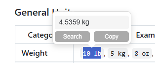

# Search Popup Extension for Text Selection

A modern browser extension that displays a smart popup menu when you select text on any webpage. Instantly search, copy, or convert selected text — including units and currencies — right from the popup. The extension adapts its theme to match the page (light/dark) and works on all websites.

## Features

- **Contextual Popup:** Appears when you select text on any webpage.
  - **Search:** Instantly search Google for the selected text or visit a detected website.
  - **Copy:** Copy the selected text to your clipboard with robust fallback handling.
  
  
 
- **Unit & Currency Conversion:**
  - Detects and converts common units (kg, lb, mph, km, etc.) and currencies (USD, EUR, GBP, etc.)
  - Supports both period and comma as decimal separators (e.g., 569,00€ or 569.00€)

   
- **URL Detection:** Recognizes website addresses in your selection and offers to visit them directly.
- **Time zone conversion:** Converts Time zones to your time.
- **Adaptive Theming:** Popup automatically switches between light and dark mode based on the underlying page background for optimal readability.

- **Dynamic Positioning:** Popup appears above or below the selection with an arrow, always within the viewport.
- **Auto-hide on Scroll/Resize:** Disappears smoothly to avoid obstructing content.
- **Lightweight & Efficient:** Minimal impact on page performance.

## Supported Conversions

The extension supports a wide range of unit and currency conversions. Simply select the text (e.g., `10 lbs` or `0.5 BTC`) to see the result.

### General Units

| Category      | Example From                                      | To          |
|---------------|---------------------------------------------------|-------------|
| **Weight**    | `10 lb`, `5 kg`, `8 oz`, `500 g`                    | `kg`, `lb`, `g`, `oz` |
| **Temperature**| `68 °F`, `20 °C`                                  | `°C`, `°F`    |
| **Speed**     | `60 mph`, `100 km/h`, `30 mpg`, `8 l/100km`         | `km/h`, `mph`, `l/100km`, `mpg` |
| **Volume**    | `5 gal`, `20 l`, `2 qt`, `12 fl`, `250 ml`          | `l`, `gal`, `l`, `ml`, `fl` |
| **Distance**  | `10 mi`, `15 km`, `50 yd`, `100 m`, `10 ft`, `12 in` | `km`, `mi`, `m`, `yd`, `m`, `cm` |
| **Power**     | `150 kW`, `200 hp`                                | `hp`, `kW`    |
| **Torque**    | `150 lb ft`, `200 Nm`                             | `Nm`, `lb ft` |

### Cooking Measurements

| Example From                                                              | To   |
|---------------------------------------------------------------------------|------|
| `1.5 cup`, `2 tbsp`, `0.5 tsp`, `8 fl oz`, `1 pint`, `1 quart`, `1 gallon` | `ml` |

### Time Zone Conversion Examples

| Example         | Description                        | Output Example           |
|----------------|------------------------------------|-------------------------|
| `5 PM PST`     | 12-hour US Pacific Time            | `03:00 (your time)`     |
| `14:00 EST`    | 24-hour US Eastern Time            | `21:00 (your time)`     |
| `11:30 am CET` | 12-hour Central European Time      | `12:30 (your time)`     |
| `23:15 GMT`    | 24-hour Greenwich Mean Time        | `01:15 (your time)`     |
| `8:00 UTC`     | 24-hour Coordinated Universal Time | `11:00 (your time)`     |
| `10:00pm PT`     | 12-hour America/Los_Angeles | `08:00 (your time)`     |

### Fiat Currency Examples

| Example           | Description                        |
|-------------------|------------------------------------|
| `1,600,000 TRY`    | Turkish Lira with thousands comma   |
| `569,00€`         | Euro with comma decimal             |
| `569.00€`         | Euro with dot decimal               |
| `$1,234.56`       | US Dollar with comma thousands      |
| `1.234,56 USD`    | US Dollar with dot thousands, comma decimal |
| `£2,000`          | British Pound with thousands comma  |
| `100 BGN`         | Bulgarian Lev                      |
| `¥10,000`         | Japanese Yen                       |
| `₹5,00,000`       | Indian Rupee (lakh format)          |
| `10 USD`          | US Dollar plain                    |
| `20 EUR`          | Euro plain                         |
| `50 GBP`          | British Pound plain                |

### Cryptocurrencies

All cryptocurrency conversions are fetched from the CoinGecko API and converted to `USD`. Just select the amount and symbol (e.g., `0.5 BTC`).

| Example | Name | Example | Name |
|--------------|-----------------|--------------|---------------|
| `1 BTC` | Bitcoin | `1.5 ETH` | Ethereum |
| `50 XRP` | Ripple | `10 LTC` | Litecoin |
| `2.1 BCH` | Bitcoin Cash | `30.05 DOT` | Polkadot |
| `50 LINK` | Chainlink | `1000 XLM` | Stellar |
| `5 BNB` | Binance Coin | `200 EOS` | EOS |
| `0.5 YFI` | Yearn.finance | `13 XAG` | `1,44 XAU` |
| `20 BITS` | `250 SATS` | | |

## Installation

**From Chrome web store:**

https://chromewebstore.google.com/detail/search-popup/plaekmbmccfiagpfodadmohfmmbkblam

**Manual installation:**

1. **Download the Extension Files:**
   - Clone or download and extract the repo.
2. **Open Chrome Extensions Page:**
   - Go to `chrome://extensions` in your browser.
3. **Enable Developer Mode:**
   - Toggle "Developer mode" on (top right).
4. **Load Unpacked Extension:**
   - Click "Load unpacked" and select the folder containing `manifest.json`.
5. **Done!**
   - The extension is now active and ready to use.

Works on all Chromium-based browsers (Chrome, Vivaldi, Edge, Brave, etc.).

---

## Advanced Features
- **Clipboard Fallback:** Uses modern Clipboard API with fallback for maximum compatibility.
- **Exchange Rate Caching:** Currency rates are cached and updated daily for fast, offline-friendly conversion.
- **Locale-aware Number Parsing:** Handles both `1,234.56` and `1.234,56` formats.

---

*Portions of this app were created using various AI tools!*

## Developed and tested on
- Vivaldi 7.5

Other Chromium browsers should work as well.