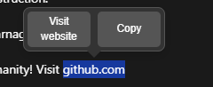
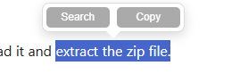

# Text Selection Popup Extension
A extension inspired by Opera Browser's own popup menu that displays a convenient popup menu when you select text on a webpage, allowing you to quickly search or copy the selected text. In mine version the popup intelligently adapts its theme (light/dark) based on the underlying webpage's background.

## Features

White/Dark mode depending on the background of the webpage 

Auto-detecting websites in selected text - Done 
Unit conversion - Done

Currency conversion - Done

TODO:
Make the extension pick the default search engine
Time zone conversion

* **Contextual Popup:** Appears when text is selected on any webpage.
* **Quick Actions:**
    * **Search:** Opens a new Google search tab with the selected text.
    * **Copy:** Copies the selected text to the clipboard.
* **Adaptive Theming:** Automatically switches between a light and dark theme to match the webpage's background, ensuring readability.
* **Dynamic Positioning:** The popup positions itself intelligently above or below the selected text, with an arrow indicating the selection.
* **Scroll & Resize Handling:** The popup disappears smoothly on page scroll or window resize to prevent obstruction.
* **Lightweight & Efficient:** Designed to be unobtrusive and performant.

## Installation

To install this extension in Google Chrome:

1.  **Download the Extension Files:**
    * Clone the repo or download it and extract the zip file.

2.  **Open Chrome Extensions Page:**
    * Open Google Chrome.
    * Type `chrome://extensions` in the address bar and press Enter.

3.  **Enable Developer Mode:**
    * In the top right corner of the Extensions page, toggle the "Developer mode" switch to the **on** position.

4.  **Load Unpacked Extension:**
    * Click the "Load unpacked" button that appears on the left side.
    * Navigate to the folder where you saved the extension files (the folder containing `manifest.json` and `content.js`).
    * Select the folder and click "Select Folder".

5.  **Extension Installed:**
    * The "Text Selection Popup" extension should now appear in your list of installed extensions and be active.

## How to Use

1.  Navigate to any webpage.
2.  Select (highlight) any piece of text with your mouse.
3.  The popup will appear near your selection with "Search" and "Copy" buttons.
    * Click "Search" to search the selected text on Google.
    * Click "Copy" to copy the text to your clipboard.
4.  The popup will automatically disappear if you:
    * Click outside the popup.
    * Scroll the page.
    * Resize the window.
    * Make a new selection.

---

!A portion of this app was created using various AI tools!

Extension Tested on
==============
Vivaldi 7.3
