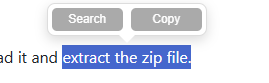
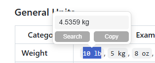
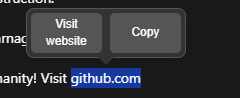

# Search Popup Extension for Text Selection

A modern browser extension that displays a smart popup menu when you select text on any webpage. Instantly search, copy, or convert selected text — including units and currencies — right from the popup. The extension adapts its theme to match the page (light/dark) and works on all websites.

## Features

- **Contextual Popup:** Appears when you select text on any webpage.
  - **Search:** Instantly search Google for the selected text or visit a detected website.
  - **Copy:** Copy the selected text to your clipboard with robust fallback handling.
  
  
 
- **Unit & Currency Conversion:**
  - Detects and converts common units (kg, lb, mph, km, etc.) and currencies (USD, EUR, GBP, etc.)
  - **Real-time Cryptocurrency Conversion:** Supports 30+ cryptocurrencies with live prices from CoinGecko API
  - Supports both period and comma as decimal separators (e.g., 569,00€ or 569.00€)

   
- **URL Detection:** Recognizes website addresses in your selection and offers to visit them directly.
- **Time zone conversion:** Converts Time zones to your time.
- **Adaptive Theming:** Popup automatically switches between light and dark mode based on the underlying page background for optimal readability.

- **Dynamic Positioning:** Popup appears above or below the selection with an arrow, always within the viewport.
- **Auto-hide on Scroll/Resize:** Disappears smoothly to avoid obstructing content.
- **Lightweight & Efficient:** Minimal impact on page performance.

## Supported Conversions

The extension supports a wide range of unit and currency conversions. Simply select the text (e.g., `10 lbs` or `0.5 BTC`) to see the result.

### General Units

| Category      | Example From                                      | To          |
|---------------|---------------------------------------------------|-------------|
| **Weight**    | `10 lb`, `5 kg`, `8 oz`, `500 g`                    | `kg`, `lb`, `g`, `oz` |
| **Temperature**| `68 °F`, `20 °C`                                  | `°C`, `°F`    |
| **Speed**     | `60 mph`, `100 km/h`, `30 mpg`, `8 l/100km`         | `km/h`, `mph`, `l/100km`, `mpg` |
| **Volume**    | `5 gal`, `20 l`, `2 qt`, `12 fl`, `250 ml`          | `l`, `gal`, `l`, `ml`, `fl` |
| **Distance**  | `10 mi`, `15 km`, `50 yd`, `100 m`, `10 ft`, `12 in` | `km`, `mi`, `m`, `yd`, `m`, `cm` |
| **Power**     | `150 kW`, `200 hp`                                | `hp`, `kW`    |
| **Torque**    | `150 lb ft`, `200 Nm`                             | `Nm`, `lb ft` |

### Cooking Measurements

| Example From                                                              | To   |
|---------------------------------------------------------------------------|------|
| `1.5 cup`, `2 tbsp`, `0.5 tsp`, `8 fl oz`, `1 pint`, `1 quart`, `1 gallon` | `ml` |

### Time Zone Conversion Examples

| Example         | Description                        | Output Example           |
|----------------|------------------------------------|-------------------------|
| `5 PM PST`     | 12-hour US Pacific Time            | `03:00 (your time)`     |
| `14:00 EST`    | 24-hour US Eastern Time            | `21:00 (your time)`     |
| `11:30 am CET` | 12-hour Central European Time      | `12:30 (your time)`     |
| `23:15 GMT`    | 24-hour Greenwich Mean Time        | `01:15 (your time)`     |
| `8:00 UTC`     | 24-hour Coordinated Universal Time | `11:00 (your time)`     |
| `10:00pm PT`     | 12-hour America/Los_Angeles | `08:00 (your time)`     |

### Fiat Currency Examples

| Example           | Description                        |
|-------------------|------------------------------------|
| `1,600,000 TRY`    | Turkish Lira with thousands comma   |
| `569,00€`         | Euro with comma decimal             |
| `569.00€`         | Euro with dot decimal               |
| `$1,234.56`       | US Dollar with comma thousands      |
| `1.234,56 USD`    | US Dollar with dot thousands, comma decimal |
| `£2,000`          | British Pound with thousands comma  |
| `100 BGN`         | Bulgarian Lev                      |
| `¥10,000`         | Japanese Yen                       |
| `₹5,00,000`       | Indian Rupee (lakh format)          |
| `€5.00,000`       | Euro with comma and dot         |
| `10 USD`          | US Dollar plain                    |
| `20 EUR`          | Euro plain                         |
| `50 GBP`          | British Pound plain                |

### Cryptocurrencies

All cryptocurrency conversions are fetched in real-time from the CoinGecko API and converted to your preferred currency (USD by default). Just select the amount and symbol (e.g., `1 BTC`, `5 ETH`).

**Supported Cryptocurrencies (30+ total):**

| Name | Example | Name | Example |
|------|---------|------|---------|
| Bitcoin | `1 BTC` | Ethereum | `0.16 ETH` |
| Ripple | `0.5 XRP` | Litecoin | `2.5 LTC` |
| Bitcoin Cash | `0.8 BCH` | Cardano | `150 ADA` |
| Polkadot | `25 DOT` | Chainlink | `10 LINK` |
| Stellar | `500 XLM` | Dogecoin | `1000 DOGE` |
| Tether | `100 USDT` | Binance Coin | `0.5 BNB` |
| Solana | `3 SOL` | Tron | `200 TRX` |
| EOS | `50 EOS` | Tezos | `75 XTZ` |
| Cosmos | `20 ATOM` | VeChain | `5000 VET` |
| Ethereum Classic | `5 ETC` | Filecoin | `100 FIL` |
| Aave | `2 AAVE` | Uniswap | `15 UNI` |
| SushiSwap | `50 SUSHI` | Yearn.finance | `0.1 YFI` |
| Compound | `5 COMP` | Maker | `0.5 MKR` |
| Synthetix | `25 SNX` | UMA | `100 UMA` |
| Zcash | `3 ZEC` | Dash | `8 DASH` |
| Monero | `1 XMR` | Bitcoin SV | `10 BSV` |
| Avalanche | `5 AVAX` | Polygon | `1000 MATIC` |

**Usage Examples:**
- Select `1 BTC` → Shows current Bitcoin value in your preferred currency
- Select `5 ETH` → Shows current Ethereum value for 5 tokens
- Select `BTC` → Shows current Bitcoin value for 1 token
- Select `0.5 bitcoin` → Shows current Bitcoin value for 0.5 tokens

## Installation

**From Chrome web store:**

https://chromewebstore.google.com/detail/search-popup/plaekmbmccfiagpfodadmohfmmbkblam

**Manual installation:**

1. **Download the Extension Files:**
   - Clone or download and extract the repo.
2. **Open Chrome Extensions Page:**
   - Go to `chrome://extensions` in your browser.
3. **Enable Developer Mode:**
   - Toggle "Developer mode" on (top right).
4. **Load Unpacked Extension:**
   - Click "Load unpacked" and select the folder containing `manifest.json`.
5. **Done!**
   - The extension is now active and ready to use.

Works on all Chromium-based browsers (Chrome, Vivaldi, Edge, Brave, etc.).

## Required Permissions

The extension requires minimal permissions to function. Here's what each permission does and why it's needed:

### Browser Permission Requests (and what they actually do):

- **"Modify data you copy and paste"** (`clipboardWrite`)
  - **What it actually does:** Allows the extension to copy selected text or converted values to your clipboard when you click the "Copy" button
  - **Why it's needed:** Core functionality - without this, the copy feature wouldn't work
  - **Privacy note:** Only writes to clipboard, never reads your clipboard data

- **"Read your browsing history"** (`storage`)
  - **What it actually does:** Stores your extension preferences (preferred currency, search engine, API keys) locally in your browser
  - **Why it's needed:** Remembers your settings between browser sessions
  - **Privacy note:** Only stores extension settings locally, never accesses your actual browsing history

- **"Access your data on all websites"** (`<all_urls>`)
  - **What it actually does:** Allows the extension to detect text selection and show the popup on any website you visit
  - **Why it's needed:** Core functionality - the extension needs to work on all websites to detect when you select text
  - **Privacy note:** Only monitors text selection events and makes API calls for currency conversion, doesn't track or collect your browsing data

### Network Requests:
The extension makes secure HTTPS requests to:
- `api.coingecko.com` - For real-time cryptocurrency prices and exchange rates
- Search engines (Google, DuckDuckGo, etc.) - Only when you click the search button

### Security & Privacy:
- Uses Manifest V3 (latest browser security standard)
- No access to sensitive browser APIs like tabs, bookmarks, or passwords
- All data processing happens locally in your browser
- Settings are stored locally and never transmitted to external servers
- Open source - you can review all code in this repository

---

## Advanced Features
- **Clipboard Fallback:** Uses modern Clipboard API with fallback for maximum compatibility.
- **Exchange Rate Caching:** Currency rates are cached and updated daily for fast, offline-friendly conversion.
- **Real-time Crypto Prices:** Cryptocurrency prices are fetched live from CoinGecko API with CORS proxy fallback.
- **Locale-aware Number Parsing:** Handles both `1,234.56` and `1.234,56` formats.
- **Multi-format Number Support:** Supports both Western (1,000,000) and Indian (10,00,000) number formats.
- **Rate Limiting Protection:** Multiple CORS proxy fallbacks ensure reliable API access.

---

*Portions of this app were created using various AI tools!*

## Developed and tested on
- Vivaldi 7.5

Other Chromium browsers should work as well.